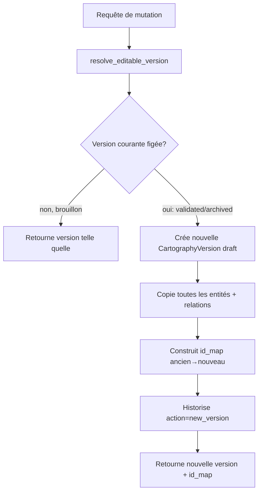

# Documentation développeur — Cartographies multiples et versionning

## 1. Modèle de données

```
backend/app/models/cartography.py
├── Cartography          # id, project_id, name, description, type, status,
│                        #   author, is_active, is_archived, created_at, updated_at,
│                        #   validated_at, validated_by
├── CartographyVersion   # id, cartography_id, version ("1.0", "1.1", …), status,
│                        #   author, created_at, validated_at, validated_by,
│                        #   is_current (bool)
└── CartographyHistory   # id, cartography_id, version_id, version_label, author,
                         #   action, comment, created_at
```

`UrbanismEntity` et `UrbanismRelation` (`backend/app/models/entities.py`) portent une
colonne nullable `cartography_version_id` (FK → `cartography_versions.id`). La
nullabilité garantit la compatibilité avec les lignes créées avant cette évolution ; ces
lignes sont rattachées à la cartographie/version par défaut par le backfill (§ 3).

La contrainte d'unicité de `UrbanismRelation` est passée de
`(source_id, relation_type, target_id)` à
`(cartography_version_id, source_id, relation_type, target_id)` : deux versions (ou deux
cartographies) peuvent contenir la même relation sans collision.

### Statuts

```python
CARTOGRAPHY_STATUSES = ("draft", "in_validation", "validated", "archived")
```

Une `Cartography.status` reflète le statut de sa version courante (`is_current=True`),
sauf `archived` qui est un attribut propre à la cartographie (indépendant du statut de
version) posé par `archive_cartography` / retiré par `unarchive_cartography`.

## 2. Service métier — `cartography_service.py`

Emplacement : `backend/app/services/cartography_service.py`.

Fonctions principales :

| Fonction | Rôle |
|----------|------|
| `list_cartographies(db, project_id)` | Liste triée (actives d'abord, puis nom) |
| `create_cartography(db, project_id, payload, author)` | Crée cartographie + version `1.0` (brouillon), désactive les autres si `is_active` |
| `get_cartography_or_404` / `get_version_or_404` | Résolution + 404 |
| `activate_cartography(db, project_id, cartography_id)` | Bascule le flag `is_active` (une seule cartographie active par projet) |
| `update_cartography` | Modifie nom/description/type (jamais le graphe) |
| `delete_cartography` | Supprime la cartographie, ses versions, historique, et **uniquement** ses entités/relations (scopées par `cartography_version_id IN (...)`) |
| `duplicate_cartography(db, cartography_id, new_name, author)` | Clone cartographie + version courante + graphe complet (nouveaux UUID, `id_map` interne) |
| `resolve_editable_version(db, cartography_id, author)` | **Cœur du COW** : renvoie `(cartography, version, id_map)`. Si la version courante est `validated`/`archived`, crée une nouvelle version brouillon en copiant tout le graphe, journalise l'action `new_version`, et retourne le mapping `ancien_id → nouvel_id` |
| `remap_id(id_map, entity_id)` | Traduit un ID d'ancienne version vers son équivalent dans la version courante (utilisé par les routes qui reçoivent un ID potentiellement obsolète) |
| `create_new_version(db, cartography_id, author, comment)` | Force un nouveau brouillon (bouton « Créer une nouvelle version ») |
| `submit_for_validation` / `validate_cartography` | Transitions de statut + historique |
| `archive_cartography` / `unarchive_cartography` | Bascule `is_archived` + historique |
| `restore_version(db, cartography_id, version_id, author)` | Crée un nouveau brouillon dont le contenu est une copie de `version_id` |
| `list_versions` / `get_history` | Lecture historique/versions, triés par date décroissante |
| `ensure_default_cartography(db, project_id)` | Backfill : crée « Cartographie principale » v1.0 si le projet n'en a aucune, en rattachant les entités/relations existantes (celles avec `cartography_version_id IS NULL`) |
| `ensure_default_cartography_for_all_projects(db)` | Appelée au démarrage (`main.py` lifespan) pour tous les projets |

### Copy-on-write (COW)



Tous les endpoints de mutation (création/màj/suppression d'entité ou de relation, layout,
import, assistant, déduplication) appellent `resolve_editable_version` **avant** toute
écriture, puis utilisent `remap_id` sur les identifiants reçus du frontend pour gérer le
cas où le frontend référence encore un ID de l'ancienne version (le frontend rafraîchit
ensuite ses données via `onGraphMutated`).

## 3. Migration / compatibilité

Aucun outil Alembic n'étant en place, les colonnes sont ajoutées via le patch ad-hoc
`_ensure_schema_columns` dans `backend/app/main.py` :

```python
_ensure_schema_columns("urbanism_entities", [("cartography_version_id", "UUID")])
_ensure_schema_columns("urbanism_relations", [("cartography_version_id", "UUID")])
```

Au démarrage de l'application (lifespan), `ensure_default_cartography_for_all_projects`
parcourt tous les projets et crée, si nécessaire, une cartographie et version par défaut,
puis rattache (`UPDATE ... SET cartography_version_id = :id WHERE cartography_version_id
IS NULL AND project_id = :project_id`) les entités/relations orphelines. Cette opération
est **idempotente** : elle ne fait rien sur un projet déjà migré.

> Limite connue : la contrainte unique composite sur `urbanism_relations` n'est pas
> réappliquée sur les bases déjà existantes (SQLite/PG ALTER limité sans Alembic) ; elle
> s'applique uniquement aux nouvelles installations. Un vrai outil de migration
> (Alembic) est recommandé pour la prochaine itération.

## 4. Services scopés par version

Les services suivants acceptent désormais un paramètre optionnel
`cartography_version_id` (par défaut : version active du projet, résolue en interne pour
compatibilité ascendante) :

- `urbanism_engine.py` — `build_cartography`, `get_project_cartography(..., version_id=None)`, `sync_missing_r05_relations`
- `urbanism_deduplicate.py` — `deduplicate_project` (helper interne `_scope_stmt`)
- `urbanism_entity_layout.py` — `save_entity_layout(s)`, `clear_entity_layout` (helper `_owned`)
- `urbanism_edge_layout.py` — `save_edge_layout`, `clear_edge_layout` (helpers `_relation_owned`, `_entity_owned`)
- `urbanism_import/entity_writer.py`, `relation_writer.py`, `service.py`
- `urbanism_assistant/assistant_service.py` — `get_form_schema`, `assisted_create`, `assisted_link`
- `ebios/urbanism_actor_resolver.py`, `ebios/urbanism_import.py` — résolvent systématiquement la **cartographie active** du projet (pas de sélection multiple pour ces modules consommateurs)

## 5. API REST

Fichier : `backend/app/api/routes/cartography.py` (préfixe `/api`).

| Méthode | Route | Rôle |
|---------|-------|------|
| GET | `/projects/{project_id}/cartographies` | Liste |
| POST | `/projects/{project_id}/cartographies` | Création |
| GET | `/cartographies/{id}` | Détail |
| PUT | `/cartographies/{id}` | Mise à jour (nom/description/type) |
| DELETE | `/cartographies/{id}` | Suppression (cascade versions + historique + graphe) |
| POST | `/cartographies/{id}/activate` | Active la cartographie pour le projet |
| POST | `/cartographies/{id}/duplicate` | Duplication complète |
| POST | `/cartographies/{id}/new-version` | Nouvelle version brouillon forcée |
| GET | `/cartographies/{id}/versions` | Liste des versions |
| POST | `/cartographies/{id}/submit-for-validation` | Brouillon → En validation |
| POST | `/cartographies/{id}/validate` | → Validée (figée) |
| POST | `/cartographies/{id}/archive` | Archive |
| POST | `/cartographies/{id}/unarchive` | Désarchive |
| POST | `/cartographies/{id}/restore` | Restaure une version (`version_id` en body) |
| GET | `/cartographies/{id}/history` | Journal des modifications |

Endpoints `urbanism.py` étendus avec un paramètre query optionnel `cartography_id` (et
`version_id` pour la lecture seule sur `GET /projects/{id}/urbanism/graph`).

Les actions historisées (`new-version`, `submit-for-validation`, `archive`,
`unarchive`) acceptent des paramètres query optionnels `author` et `comment` pour
enrichir le journal d'audit avec le contexte utilisateur (renseignés côté frontend
depuis la session courante).

## 6. Frontend

```
frontend/src/components/urbanism/
├── cartographySelect.ts        # Logique pure : tri, sélection par défaut,
│                                # libellés de statut, format version, validations
├── exportData.ts                # Export JSON/CSV côté client (nom de fichier, download)
├── CartographyBanner.tsx        # Bandeau Projet / Cartographie / Version + Actions ▾
├── CreateCartographyModal.tsx   # Formulaire de création
├── NameCartographyModal.tsx     # "Enregistrer sous…" / "Dupliquer" (nom + validation doublon)
└── CartographyHistoryModal.tsx  # Historique versions + journal + bouton Restaurer
```

`frontend/src/pages/UrbanismSchema.tsx` orchestre l'état `projects / cartographies /
versions / selected(project, cartography, version)` et déclenche le rechargement du
graphe (`SchemaCanvas`, `UrbanismAssistant`, `UrbanismEngineEditor`) à chaque changement
de sélection. Le flag `readOnly` (vrai si la version sélectionnée n'est pas la version
courante, ou si la cartographie est archivée) est propagé à tous les composants
d'édition pour masquer les actions de mutation.

`frontend/src/api.ts` expose le client complet : `listCartographies`,
`createCartography`, `updateCartography`, `deleteCartography`, `activateCartography`,
`duplicateCartography`, `createNewCartographyVersion`, `listCartographyVersions`,
`submitCartographyForValidation`, `validateCartography`, `archiveCartography`,
`unarchiveCartography`, `restoreCartographyVersion`, `getCartographyHistory`. Les appels
`getUrbanismGraph` et les mutations d'entités/relations acceptent `cartographyId` /
`versionId` en query params.

`frontend/src/pages/UrbanismImport.tsx` ajoute un sélecteur **Cartographie cible** ; le
lien « Voir la cartographie » propage `cartographyId` en query param vers
`/schema-urbanisme`.

## 7. Tests

- Backend : `backend/tests/test_cartography.py` — CRUD, activation, versionning COW,
  validation, restauration, duplication, archivage, suppression scopée, historique,
  migration (`ensure_default_cartography`), lecture d'une version historique en
  read-only, scoping de l'import/déduplication/layout par version.
- Frontend logique pure : `frontend/src/components/urbanism/cartographySelect.test.ts`,
  `exportData.test.ts`.

## 8. Extensions futures

- **Export ArchiMate** : ajouter un writer dans une future `exportData.ts` /
  service backend dédié, réutilisant le même graphe scopé par version (architecture déjà
  préparée : le graphe exporté est toujours résolu via `get_project_cartography(...,
  version_id=...)`).
- **Migrations Alembic** : remplacer `_ensure_schema_columns` par de vraies révisions
  pour fiabiliser l'évolution du schéma (contraintes uniques, index) sur les bases déjà
  peuplées.
- **Permissions fines par cartographie** : actuellement les permissions sont au niveau
  projet ; un futur besoin pourrait vouloir restreindre l'édition d'une cartographie à
  certains rôles/équipes.
