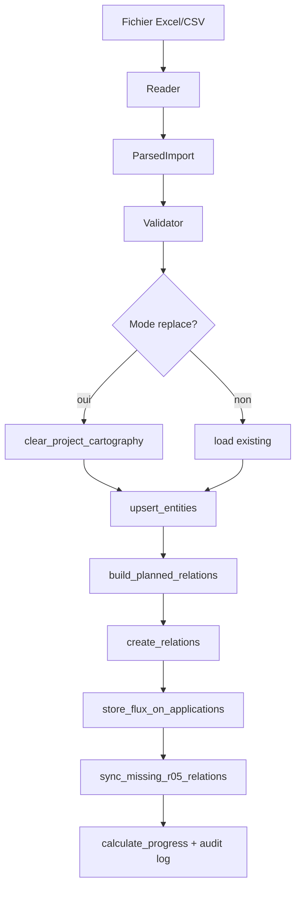

# Documentation développeur — Import cartographie urbanisme (V1.4)

## Architecture modulaire

```
backend/app/services/urbanism_import/
├── types.py              # Types métier (ImportRow, ImportPreview, ImportReport)
├── sheet_registry.py     # Contrat des 15 feuilles officielles
├── readers/
│   ├── base.py           # Interface ImportReader (extensible)
│   ├── excel_reader.py   # Lecture .xlsx (openpyxl)
│   ├── csv_reader.py     # Lecture .csv
│   └── row_parser.py     # Parsing lignes → ImportRow
├── validator.py          # Contrôles qualité pré-import
├── relation_builder.py   # Génération relations R02–R28
├── entity_writer.py      # Création / mise à jour entités
├── relation_writer.py    # Persistance relations + flux
├── import_logger.py      # Journal audit
├── template_generator.py # Modèle Excel officiel
└── service.py            # Orchestration preview + execute
```

## Extensibilité connecteurs

Pour ajouter ServiceNow, GLPI, NetBox, LeanIX, MEGA HOPEX, JSON ou XML :

1. Créer un reader dans `readers/` implémentant `ImportReader.read() → ParsedImport`
2. Enregistrer le reader dans `service._reader_for_filename()` ou via un paramètre `source`
3. Réutiliser `validator`, `relation_builder`, `entity_writer`, `relation_writer` sans modification

Le mapping feuille → type d'entité est centralisé dans `sheet_registry.py`.

## API

| Méthode | Route | Rôle |
|---------|-------|------|
| GET | `/api/urbanism/import/template` | Télécharge le modèle Excel |
| POST | `/api/projects/{id}/urbanism/import/preview` | Prévisualisation (multipart) |
| POST | `/api/projects/{id}/urbanism/import` | Exécution import |

Paramètres multipart : `file`, `mode` (`merge`|`replace`), `force` (bool).

## Flux d'exécution



## Relations automatiques

| Lien import | Relation métamodèle |
|-------------|---------------------|
| Métier → Objectif | R02 `définit` |
| Objectif → Processus | R05 `est pris en compte dans` |
| Métier → Processus | R03 `pilote` |
| Processus → Activité | R06 `se décompose en` |
| Activité → Classe | R07 `manipule` |
| Classe → Fonction | R08 `donne lieu à` |
| Fonction → Application | Lien dérivé (`_assistant_derived_links`) |
| Application → Serveur | R21 + R25 via poste d'accès généré |
| Serveur → Site | R28 `est hébergé sur` |
| Flux | Stocké dans `properties.import_flux` |

## Identifiants d'import

Chaque entité reçoit `properties._import_id` = ID Excel pour la fusion incrémentale.

## Tests

```bash
cd backend
python -m pytest tests/test_urbanism_import.py -q
```

## Frontend

- Page : `frontend/src/pages/UrbanismImport.tsx`
- API : `previewUrbanismImport`, `executeUrbanismImport`, `downloadUrbanismImportTemplate`
- Menu : `routing/navigation.ts` → `Importer une cartographie`
